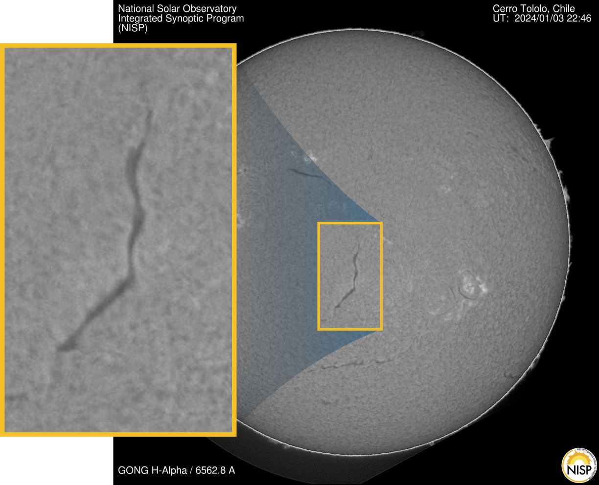
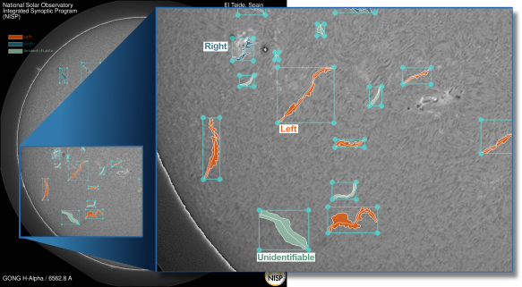

# ☀️ Solar Filament Segmentation Challenge (MAGFiLO Benchmark)

[](https://www.nature.com/articles/s41597-024-03876-y)
[](#-task--objective)
[](#-the-magfilo-dataset)
[](#-evaluation--leaderboard)
[](#-submission-format)

Welcome to the **Solar Filament Segmentation Challenge**! This competition invites researchers, data scientists, and machine learning practitioners to develop state-of-the-art algorithms for automated, fine-grained segmentation of solar filaments from ground-based H-Alpha solar observations.

---

## 📌 Table of Contents

- [Overview & Motivation](#-overview--motivation)
- [Task & Objective](#-task--objective)
- [The MAGFiLO Dataset](#-the-magfilo-dataset)
- [Key Technical Challenges](#-key-technical-challenges)
- [Evaluation & Leaderboard](#-evaluation--leaderboard)
- [Mathematical Formulation](#-mathematical-formulation)
- [Submission Format](#-submission-format)
- [Quickstart: Code Example](#-quickstart-code-example)
- [References & Citations](#-references--citations)

---

## 🌌 Overview & Motivation

### What Are Solar Filaments?
**Solar filaments** are massive, dense clouds of cool solar material suspended high above the solar photosphere by strong magnetic field lines along magnetic neutral lines. When viewed against the solar disk in H-Alpha ($H\alpha$) wavelengths, they appear as dark, elongated ribbon-like features.

### Why Are They Important?
Solar filaments are at the root of major space weather events, including:
* **Coronal Mass Ejections (CMEs)**
* **Solar Flares**
* **Solar Energetic Particle (SEP) Storms**

An Earth-directed CME triggered by a filament eruption can severely disrupt global electric power grids, degrade satellite operations, corrupt GPS navigation signals, pose radiation hazards to polar flights, and threaten space missions. Automated, precise detection and segmentation of solar filaments are vital for space weather monitoring and forecasting operations.

<div align="center">
  
  <p><em>Figure 1: Full-disk H-Alpha observation highlighting solar filaments across the solar surface.</em></p>
</div>

---

## 🎯 Task & Objective

The primary objective of this challenge is to build robust, high-precision algorithms (using traditional computer vision, machine learning, or deep neural networks) to produce accurate, pixel-level segmentation masks for individual solar filaments.

### Core Goals:
1. **Morphological Fidelity**: Delineate the complete boundary and fine-scale structures (e.g., thin barbs) of each solar filament.
2. **Noise Suppression**: Distinguish true filament material from background solar features, dark regions, and ground-based observatory imaging artifacts.
3. **Physical Continuity**: Predict contiguous structures without unwanted fragmentation ("island" artifacts) or incorrect over-merging of separate filaments.

---

## 📊 The MAGFiLO Dataset

**MAGFiLO** (*Manually Annotated GONG Filaments from H-Alpha Observations*) serves as the benchmark testbed for training, testing, and evaluating all participant models ([Scientific Data DOI: 10.1038/s41597-024-03876-y](https://doi.org/10.1038/s41597-024-03876-y)).

* **Image Modality**: Ground-based H-Alpha solar imagery from the GONG network.
* **Resolution**: Fixed **$2048 \times 2048$ pixels**.
* **Annotations**: High-quality ground-truth instance segmentation masks annotated by domain experts.

<div align="center">
  
  <p><em>Figure 2: Sample H-Alpha solar image with expert human annotations of filament boundaries.</em></p>
</div>

---

## ⚔️ Key Technical Challenges

| Challenge Area | Description & Difficulty |
| :--- | :--- |
| 🌿 **Fine-Scale Structures (Barbs)** | Filaments possess thin, thread-like features extending along magnetic field orientation ("barbs"). Capturing these fine details is crucial for inferring magnetic topology. |
| 🌫️ **Background Noise & Artifacts** | Ground-based solar observations suffer from atmospheric turbulence, uneven illumination, and imaging artifacts, making contrast separation non-trivial. |
| 🧩 **Structural Continuity** | Standard segmentation models often suffer from structural fragmentation (breaking a single filament into multiple isolated "islands") or over-merging adjacent distinct filaments. |

---

## ⚖️ Evaluation & Leaderboard

Submissions are evaluated on a combined rubric balancing quantitative metrics and qualitative model architecture standards:

### 1. Quantitative Evaluation (70% Weight)
* **Panoptic Quality (PQ)**: Primary ranking metric on the leaderboard.
* **Mean Dice Score**: Assesses pixel-level overlap accuracy using `torchmetrics.segmentation.DiceScore`.
* **IoU Score Distribution**: Measures intersection-over-union across predicted filaments.
* **Structural Penalties**: Penalizes fragmentation and over-merging via one-to-many and many-to-one relation distributions between ground-truth and predicted masks.

### 2. Qualitative Evaluation (30% Weight)
* **Pipeline Clarity**: Detailed documentation of end-to-end processing (preprocessing, backbone, head, post-processing).
* **Morphological Fidelity**: Visual inspection of predicted segmentations overlaid on solar images.
* **Code Quality & Open-Access**: Modularity, clean documentation, and compliance with the Open-Access code policy.

> [!NOTE]
> **Leaderboard Splitting**:
> The public scoreboard displays the mean score evaluated on ~50% of the test images. The final leaderboard rank will be based on the remaining ~50% private test set.

---

## 🧮 Mathematical Formulation

### 1. Panoptic Quality (PQ)
The primary evaluation metric, **Panoptic Quality**, evaluates segment matching accuracy along with classification precision:

$$\text{PQ}(Y, \hat{Y}) = \frac{\sum_{(y, \hat{y}) \in TP} \text{IoU}(y, \hat{y})}{|TP| + 0.5|FP| + 0.5|FN|}$$

Where:
* $Y$: Set of ground-truth filament segments $y$.
* $\hat{Y}$: Set of predicted filament segments $\hat{y}$.
* $TP$: True Positive matched segment pairs ($\text{IoU} > 0.5$).
* $FP$: False Positive predictions (unmatched predicted filaments).
* $FN$: False Negative ground-truth segments (missed actual filaments).
* $|\cdot|$: Set cardinality operation.

### 2. Intersection over Union (IoU)

$$\text{IoU}(y, \hat{y}) = \frac{|y \cap \hat{y}|}{|y \cup \hat{y}|} = \frac{\sum (y \odot \hat{y})}{\sum (y \oplus \hat{y} \ominus y \odot \hat{y})}$$

Where $\odot$ denotes element-wise AND (intersection) and $\oplus$ denotes element-wise OR (union).

---

## 📥 Submission Format

Participants must submit a single **CSV file** containing run-length encoded (RLE) mask predictions for all test images.

### CSV Structure

| `filament_id` | `segmentation_rle` |
| :--- | :--- |
| `20150125172714Mh_1` | `f8uSDds...VQNC` |
| `20150125172714Mh_2` | `KHT%$HD...9>km` |
| `20150125172714Mh_3` | `YQNEgn1...BH6^` |
| ... | ... |
| `20170501024112Bh_1` | `HBy4d6D...97*D` |

> [!IMPORTANT]
> **Rules & Guidelines for Submission:**
> 1. **Image Dimensions**: Fixed at **$2048 \times 2048$ pixels**.
> 2. **RLE Format**: Provide only the RLE string counts (do not include quotation marks `'` or `"`).
> 3. **Unique Keys**: Append unique suffix indexes (e.g., `_1`, `_2`, `_3`) to the base image ID for each distinct filament identified in that image.
> 4. **Matching Logic**: The evaluation protocol matches predicted segments with ground-truth segments based on actual spatial overlap ($\text{IoU} > 0.5$), not row index order.

---

## 🚀 Quickstart: Code Example

You can easily encode binary segmentation masks into the required RLE string format using `pycocotools`:

```python
import numpy as np
from pycocotools import mask as mask_utils

def binary_mask_to_rle_string(binary_mask: np.ndarray) -> str:
    """
    Converts a binary numpy array mask (2048x2048) into an RLE count string.
    
    Args:
        binary_mask (np.ndarray): 2D uint8 binary mask where 1 = filament, 0 = background.
        
    Returns:
        str: UTF-8 decoded RLE count string for CSV submission.
    """
    # Ensure Fortran array ordering as required by pycocotools
    fortran_mask = np.asfortranarray(binary_mask.astype(np.uint8))
    
    # Encode mask to RLE dictionary
    rle_dict = mask_utils.encode(fortran_mask)
    
    # Extract RLE counts string
    rle_string = rle_dict['counts'].decode('utf-8')
    return rle_string

def rle_string_to_binary_mask(rle_string: str, height: int = 2048, width: int = 2048) -> np.ndarray:
    """
    Decodes an RLE count string back into a 2D binary numpy mask.
    """
    rle_dict = {
        'size': [height, width],
        'counts': rle_string.encode('utf-8')
    }
    binary_mask = mask_utils.decode(rle_dict)
    return binary_mask
```

---

## 📚 References & Citations

1. **Solar Filament Segmentation Challenge 2026 (Kaggle Benchmark)**:
```bibtex
@misc{filament-segmentation-2026,
    author = {Azim Ahmadzadeh and Dustin J. Kempton and Qin Li and Alexei A. Pevtsov},
    title = {Solar Filament Segmentation Challenge 2026},
    year = {2026},
    howpublished = {\url{https://kaggle.com/competitions/filament-segmentation-2026}},
    note = {Kaggle}
}
```

2. **MAGFiLO Dataset Paper**:
   > K. A. et al., *Manually Annotated GONG Filaments from H-Alpha Observations (MAGFiLO)*, Scientific Data (2024).  
   > 🔗 [DOI: 10.1038/s41597-024-03876-y](https://doi.org/10.1038/s41597-024-03876-y)

3. **Panoptic Quality Evaluation Metric**:
   > Kirillov, A., He, K., Girshick, R., Rother, C., & Dollár, P. (2019). *Panoptic Segmentation*. In Proceedings of the IEEE/CVF Conference on Computer Vision and Pattern Recognition (CVPR).  
   > 🔗 [DOI: 10.1109/CVPR.2019.00963](https://doi.org/10.1109/CVPR.2019.00963)
